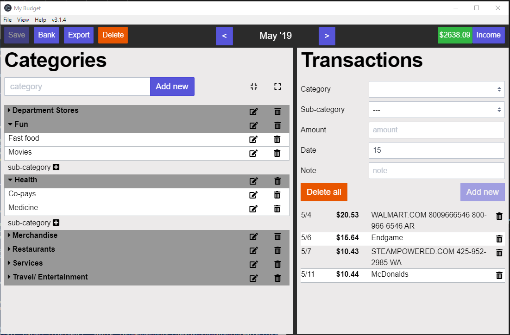

# Welcome
Take control of your budget, download it today. It is free - forever.

# Features
- Completely offline - we are not saving any information of yours, it remains on your computer.
- Simple - only contains what you need to budget.
- Passphrase protected - protect your data by providing a passphrase to encrypt your data (this is optional).
- Limited* support to sync transactions with your bank. [See here](https://github.com/reZach/my-budget/wiki/Creating-a-new-connector) for more details.
- Built with [Electron](https://electronjs.org/) - supported on Linux, MacOS and Windows.

# Download
You can download the application [here](https://github.com/reZach/my-budget/releases). The application is still in beta, so please be aware there may be breaking changes until we have stabilized for the first major release.

# Support
Join us on [slack](https://join.slack.com/t/my-budget/shared_invite/enQtNjA0NDg1MTI2MzI2LTkxZmI0M2YzMGQ2YzlkMDc1YzkxMjU1M2EyZmI4MjlkYTY3MzgwNzVhMmY2MzJhNmM4OGE0Njc0NDZiMDVkY2U) if you have concerns or questions. For bugs, please go to [github](https://github.com/reZach/my-budget/issues) and submit an issue, thanks.

# Documentation
Have a question how to use My Budget? All of it is available on the [wiki](https://github.com/reZach/my-budget/wiki).